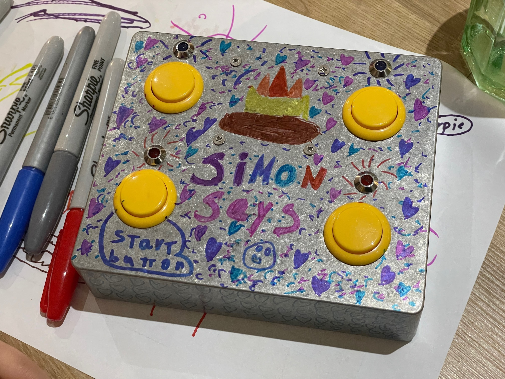

# simon-says-clem
Arduino code for a Simon Says toy

Based on [an OKdo project](https://www.okdo.com/project/simon-says-game/). The circuit is the same, but I rewrote a bunch of the code to make the controls more responsive and added snippets of the song _Nazareth_ from [Nativity (2009)](https://www.imdb.com/title/tt1242447/) every few levels.
